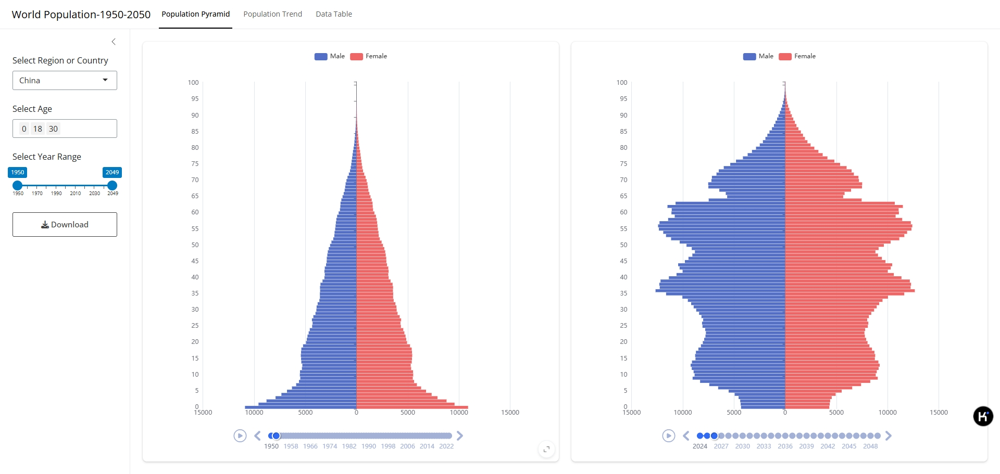
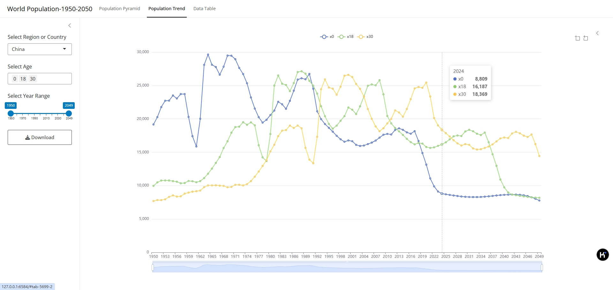
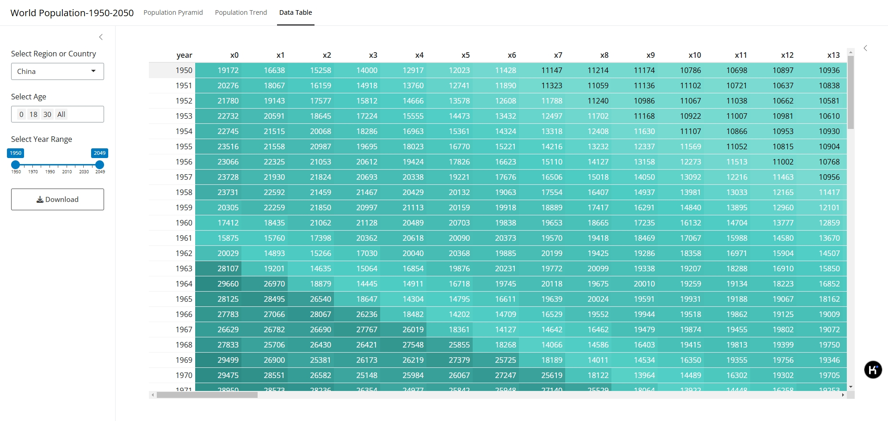

# World Population Data (1950-2050)

This Shiny application provides an interactive interface to visualize population data for different regions and countries from the year 1950 to 2050. Users can explore population trends, age distribution through population pyramids, and view the data in tabular form. Additionally, users can download the data as a CSV file for further analysis.

## Data Source

[United Nations-World Population Prospects]([https://population.un.org/wpp/(https://population.un.org/wpp/](https://population.un.org/wpp/(https://population.un.org/wpp/)%7B.uri%7D)

## Features

-   **Select Region or Country**: Filter population data by region or country.
-   **Select Age Groups**: Choose specific age groups to display in the charts.
-   **Year Range Filter**: Select the range of years to analyze the population trends.
-   **Population Pyramid**: Visualize the population distribution for selected years and regions/countries.
-   **Population Trend**: Track the population trend over time for the selected age groups.
-   **Download Data**: Download the population data for the selected country/region as a CSV file.







## Libraries Used

This Shiny app uses the following libraries:

-   `shiny`: To build the interactive web application.
-   `echarts4r`: To create interactive charts (e.g., population pyramids and trends).
-   `dplyr` and `tidyr`: For data manipulation and cleaning.
-   `bslib`: To style the UI with Bootstrap themes.
-   `reactable`: For displaying data in an interactive table format.

## Application Overview

### User Interface (UI)

The app consists of the following sections:

-   **Sidebar**:
    -   Dropdown to select the region or country.
    -   Multiple selection input for age groups.
    -   Slider to select the year range for analysis.
    -   Download button to download the data as CSV.
-   **Navigation Panels**:
    -   **Population Pyramid**: Displays interactive population pyramids for selected years and region.
    -   **Population Trend**: Displays a line chart showing population trends over the selected years.
    -   **Data Table**: Displays the data in tabular format with color-coded values based on population.

### Server Logic

-   **Reactive Data**: The server processes the data based on user inputs like country, age, and year range.
-   **Population Pyramid**: The data is transformed and rendered as population pyramids using `echarts4r`.
-   **Population Trend**: The population trends are shown using line charts, filtered by the selected age groups and years.
-   **Data Table**: Displays the data in a reactive table format with color mapping for better readability.

### Data Download

-   Users can download the population data for the selected region and year range as a CSV file by clicking the download button. The file will be named based on the selected region.

## How to Run

To run this application locally, you will need to have R and the required packages installed. Follow these steps:

1.  Install R from <https://cran.r-project.org/>.
2.  Install the necessary R libraries by running the following command in your R console:

``` r
install.packages(c("shiny", "echarts4r", "dplyr", "tidyr", "bslib", "reactable"))
```

Data The population data used in this app is stored in an RDS file `(df_pop.rds)` and contains information for different countries and regions from 1950 to 2100. The dataset includes population figures segmented by age groups (0 to 100+ years) for each year.

License This project is licensed under the MIT License - see the LICENSE.md file for details.

Acknowledgements The population data used in this app is sourced from United Nations. Special thanks to the authors of echarts4r, shiny, and other R packages used in this project.

### Key Points:

-   The `README.md` provides a brief description of the app, its features, and usage instructions.
-   Instructions for installing the necessary packages and running the app locally are included.
-   The application is interactive, allowing users to filter and download population data as CSV files.

# 欢迎关注微信公众号： R语言与可视化


# 如需shiny应用开发可加微信: `shinydev`


